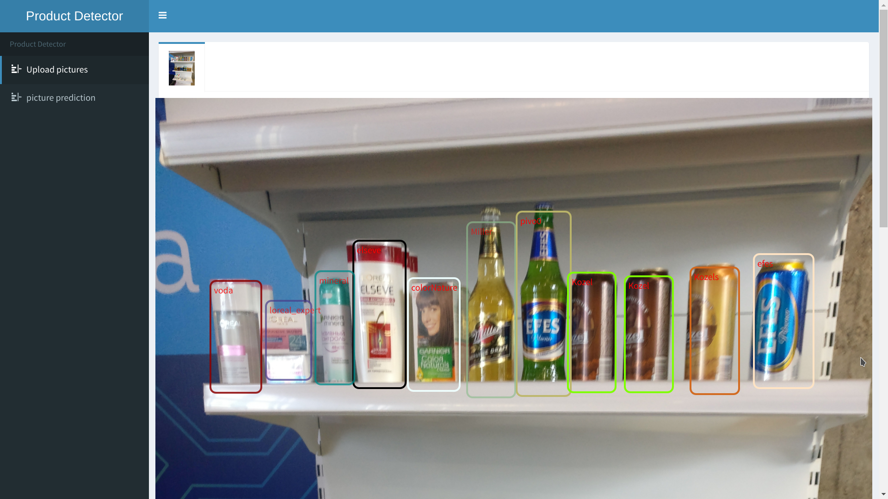

# olabsAPI

to get products bbox prediction for your image POST an image file as multipart/form-data to podol.videogorillas.com:4242/upload

example for bash:

```
curl  -F "file=@./images/test.jpg"   http://podol.videogorillas.com:4242/upload
```


as a result you will the JSON in such format:
width, height, and  xmin,ymin(top left corner of bbox) are in relative values of width and height of original picture
```json
[
  {
    "classid": 32,
    "label": "other",
    "height": 0.136,
    "width": 0.082,
    "score": 0.586,
    "xmin": 0.342,
    "ymin": 0.704
  },
  {
    "classid": 14,
    "label": "Kozels",
    "height": 0.109,
    "width": 0.069,
    "score": 0.996,
    "xmin": 0.798,
    "ymin": 0.500
  },
  {
    "classid": 26,
    "label": "pivo0",
    "height": 0.195,
    "width": 0.078,
    "score": 0.963,
    "xmin": 0.502,
    "ymin": 0.117
  },
  {
    "classid": 5,
    "label": "efes",
    "height": 0.142,
    "width": 0.085,
    "score": 0.979,
    "xmin": 0.833,
    "ymin": 0.162
  },
  {
    "classid": 33,
    "label": "Miller",
    "height": 0.185,
    "width": 0.069,
    "score": 0.64,
    "xmin": 0.433,
    "ymin": 0.128
  },
  {
    "classid": 5,
    "label": "efes",
    "height": 0.107,
    "width": 0.062,
    "score": 0.989,
    "xmin": 0.493,
    "ymin": 0.486
  }
]
```

there is debugging UI at http://podol.videogorillas.com:4242/ 

